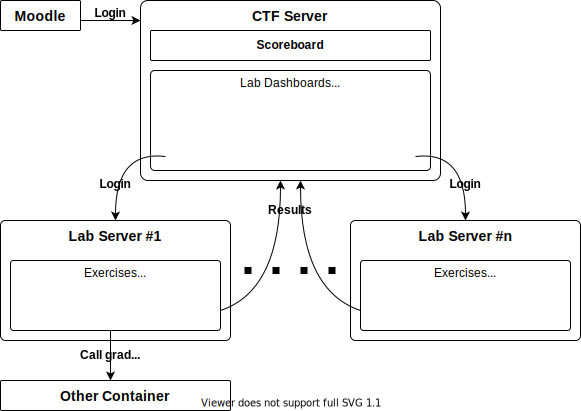

 

# CTF4E: Capture the Flag for Education

CTF4E is a framework for practical courses, which combines learning goals with gamification. It was originally designed in the context of the Cybersecurity course at the [University of Lübeck](https://www.its.uni-luebeck.de/en/).

In that course, the students have to solve a number of _labs_, which cover different security topics and consist of a set of mandatory and optional exercises. To encourage solving optional exercises, each exercises grants a number of points, which are summed up and displayed on a scoreboard. Additionally, the students can find a number of _flags_, which are hidden in the investigated systems and invite the students to take a deeper look. At the end of the term, the groups with the most points get a prize.

For easy scalability, the system is separated into two major components: First, the main CTF server, and second, a number of lab servers (see below). The CTF server keeps track of the passed exercises and manages the scoreboard, while the lab servers host the actual exercises and communicate the results back to the CTF server.

    

**Summarized features:**
- Division of a course into a number of _labs_, which each consist of a set of (mandatory/optional) _exercises_ and _flags_
- Solving an exercise grants points; wrong submissions may impose penalty points
- Flags are special strings, designed to be hidden and/or hard to acquire; flag points scale with the amount of finds
- Partitioning of students into groups, which share points and, if desired, grades
- Scoreboard with rankings per lab and for the entire course
- Fine-granular control over working times, exercise and flag points
- Detailed admin scoreboard with full insight in and control over exercise and flag submissions
- API for connecting to _lab servers_, which serve the labs themselves
- Fully configurable lab server implementation for the most common exercise types; custom lab servers are possible as well
- Integration with [Moodle](https://moodle.org/) for login and synchronizing results

## Ctf4e.Server

This is the main application, which keeps track of exercise results, flag submissions and the scoreboard. It links to the corresponding lab servers.

### Quick start

A new instance of the CTF server can be created by following these steps:
1. Pull the files from the `run/server/` folder.
2. Edit `config.json` and `.env` to match the corresponding runtime environment.
3. `docker-compose up -d` will start the CTF server.

Finally, open a browser and navigate to the specified host/port.

## Ctf4e.LabServer

This is a generic lab server implementation, suitable for most common tasks. A lab server offers an interface for entering exercise solutions, and sends its verdicts ("passed"/"not passed") to the CTF server.

**Features:**
- Integrates with the CTF server
- Keeps track of lab exercises
- Each exercise is either connected to a corresponding exercise entry on the CTF server, or produces a flag code
- Each exercise has a title, a description (optional) and a link (optional)
- Supported exercise types:
    - String: List of possible solution strings for each exercise, in key/value format
    	- Exercises may either require a specific solution (fixed, random key for each user) or an arbitrary one
    - Multiple choice: List of correct and wrong solutions, where one or all correct solutions need to be selected
    - Grading script: Triggers a script in an associated Docker container, allowing for arbitrary checks; also supports optional string input

### Quick start

The folder `run/labserver/` contains an example `docker-compose` configuration for setting up a CTF server combined with a single lab server instance.
1. Pull the files from the `run/labserver/` folder.
2. Edit `config.json`, `config-labserver1.json` and `.env` to match the corresponding runtime environment. The lab server configuration file format is documented in [`docs/labserver-config.md`](docs/labserver-config.md).
3. `docker-compose up -d` will start the CTF server and a lab server.

Finally, open a browser and navigate to the specified host/port.

## Ctf4e.Api

Utility library for creating custom .NET-based lab servers. The library offers services for communication with the CTF system, and is used by the default lab server implementation as well.

## Contributing

Contributions are appreciated! Feel free to submit issues and pull requests.

## License

The entire system is licensed under the MIT license. For further information refer to the LICENSE file.

## Screenshots

**Scoreboard**

**More screenshots**

[Lab dashboard for students](docs/media/lab-dashboard.png?raw=true) | [Admin scoreboard](docs/media/admin-scoreboard-cut.png?raw=true) | [Lab server student view](docs/media/labserver-student.png?raw=true) | [Lab server admin view](docs/media/labserver-admin.png?raw=true)
